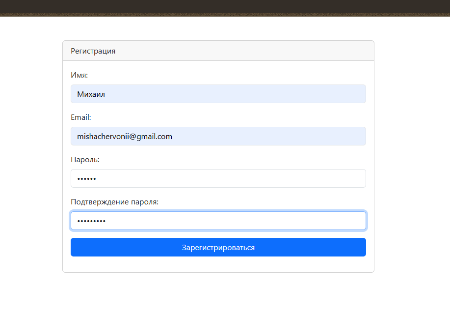
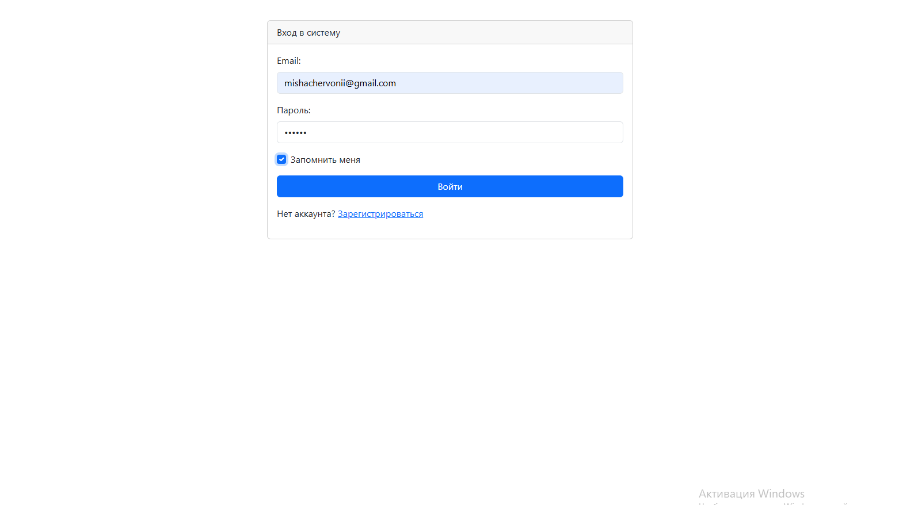
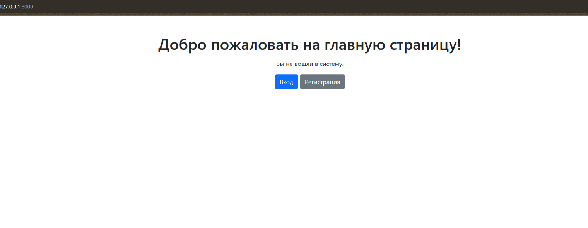

# Лабораторная работа №5. Компоненты безопасности в Laravel

## Цель работы

Познакомиться с основами компонентов безопасности в Laravel, такими как:

- Аутентификация;
- Авторизация;
- Защита от CSRF.

Изучить использование встроенных механизмов для управления доступом, включая создание защищенных маршрутов и управление ролями пользователей.

---

## №1. Подготовка к работе

Для лабораторной работы №5 создадим новый проект и базу данных `lab5`.

```bash
composer create-project laravel/laravel:^10 Lab_5
```
Создание базы данных:

```bash
CREATE DATABASE lab_5;
```
Выбираем наш базу данных

```bash
use lab_5;
```
Можем просмотреть таблицы в нашей базе данных

```bash
SHOW TABLES;
```
Заходим в наш проект .env файл и подключаем нашу базу данных(имя базы данных, пароль если установили)
```bash
DB_CONNECTION=mysql
DB_HOST=127.0.0.1
DB_PORT=3306
DB_DATABASE=misha
DB_USERNAME=root
DB_PASSWORD=198312
```
После этого нужно зайти ив кореньнашего проекта и прописать команду:
```bash
php artisan migrate 
```
Сгенерируем ключ приложения.
```bash
php artisan key:generate
```
```bash
APP_KEY=base64:hncxZx5Kaz09ZKS99A+SluigGdZqb7PrxP+3ABWF2Io=
```
---

## №2. Аутентификация пользователей

Создадим контроллер `AuthController` для управления аутентификацией пользователей:

```bash
php artisan make:controller AuthController
```

### Методы аутентификации

1. **Форма регистрации:**

```php
public function register()
{
    return view('register');
}
```

2. **Обработка формы регистрации:**

```php
public function storeRegister(Request $request)
{
    $validatedData = $request->validate([
        'name' => 'required|string|max:25',
        'email' => 'required|string|email|max:35|unique:users',
        'password' => 'required|string|min:6|confirmed',
    ]);

    $user = User::create([
        'name' => $validatedData['name'],
        'email' => $validatedData['email'],
        'password' => Hash::make($validatedData['password']),
    ]);

    Auth::login($user);

    return redirect()->route('home');
}
```

3. **Форма входа:**

```php
public function login()
{
    return view('login');
}
```

4. **Обработка формы входа:**

```php
public function storeLogin(Request $request)
{
    $credentials = $request->validate([
        'email' => 'required|string|email',
        'password' => 'required|string',
    ]);

    if (Auth::attempt($credentials)) {
        $request->session()->regenerate();

        return redirect()->route('home');
    }

    return back()->withErrors([
        'email' => 'Неверные учетные данные.',
    ])->onlyInput('email');
}
```

5. **Выход пользователя из системы:**

```php
public function logout(Request $request)
{
    Auth::logout();

    $request->session()->invalidate();
    $request->session()->regenerateToken();

    return redirect()->route('login');
}
```

---

### Настройка маршрутов

Настроим маршруты в файле `routes/web.php`:

```php
use Illuminate\Support\Facades\Route;
use App\Http\Controllers\AuthController;
use App\Http\Controllers\ProfileController;


// Главная страница
Route::get('/', function () {
    return view('home');
});

// Маршрут для формы регистрации
Route::get('/register', [AuthController::class, 'register'])->name('register');

// Маршрут для обработки регистрации
Route::post('/register', [AuthController::class, 'storeRegister'])->name('register.store');

// Маршрут для формы входа
Route::get('/login', [AuthController::class, 'login'])->name('login');

// Маршрут для обработки входа
Route::post('/login', [AuthController::class, 'storeLogin'])->name('login.store');

// Маршрут для выхода из системы
Route::post('/logout', [AuthController::class, 'logout'])->name('logout');

// Защищённые маршруты, доступные только для авторизованных пользователей
Route::middleware('auth')->group(function () {
    // Личный кабинет (пользователь может видеть только свой)
    Route::get('/profile', [ProfileController::class, 'show'])->name('profile');

    // Личный кабинет администратора (может видеть всех пользователей)
    Route::get('/admin/profiles', [ProfileController::class, 'index'])
        ->middleware('role:admin')
        ->name('admin.profiles');
});
```

---

### Создание представлений

Создадим представления:

1. **`register.blade.php`:**

```html
<<!DOCTYPE html>
<html lang="ru">
<head>
    <meta charset="UTF-8">
    <meta name="viewport" content="width=device-width, initial-scale=1.0">
    <title>Регистрация</title>
    <link href="https://cdn.jsdelivr.net/npm/bootstrap@5.3.0-alpha1/dist/css/bootstrap.min.css" rel="stylesheet">
</head>
<body>
<div class="container">
    <div class="row justify-content-center">
        <div class="col-md-6">
            <div class="card mt-5">
                <div class="card-header">{{ __('Регистрация') }}</div>
                <div class="card-body">
                    <form method="POST" action="{{ route('register.store') }}">
                        @csrf

                        <div class="mb-3">
                            <label for="name" class="form-label">Имя:</label>
                            <input type="text" name="name" id="name" class="form-control" value="{{ old('name') }}" required>
                        </div>

                        <div class="mb-3">
                            <label for="email" class="form-label">Email:</label>
                            <input type="email" name="email" id="email" class="form-control" value="{{ old('email') }}" required>
                        </div>

                        <div class="mb-3">
                            <label for="password" class="form-label">Пароль:</label>
                            <input type="password" name="password" id="password" class="form-control" required>
                        </div>

                        <div class="mb-3">
                            <label for="password_confirmation" class="form-label">Подтверждение пароля:</label>
                            <input type="password" name="password_confirmation" id="password_confirmation" class="form-control" required>
                        </div>

                        <div class="mb-3">
                            <button type="submit" class="btn btn-primary w-100">Зарегистрироваться</button>
                        </div>
                    </form>
                </div>
            </div>
        </div>
    </div>
</div>

<script src="https://cdn.jsdelivr.net/npm/bootstrap@5.3.0-alpha1/dist/js/bootstrap.bundle.min.js"></script>
</body>
</html>
>
```

2. **`login.blade.php`:**

```html
<<!DOCTYPE html>
<html lang="ru">
<head>
    <meta charset="UTF-8">
    <meta name="viewport" content="width=device-width, initial-scale=1.0">
    <title>Вход</title>
    <link href="https://cdn.jsdelivr.net/npm/bootstrap@5.3.0-alpha1/dist/css/bootstrap.min.css" rel="stylesheet">
</head>
<body>
<div class="container">
    <div class="row justify-content-center">
        <div class="col-md-6">
            <div class="card mt-5">
                <div class="card-header">{{ __('Вход в систему') }}</div>
                <div class="card-body">
                    <!-- Ошибки формы -->
                    @if ($errors->any())
                        <div class="alert alert-danger">
                            <ul>
                                @foreach ($errors->all() as $error)
                                    <li>{{ $error }}</li>
                                @endforeach
                            </ul>
                        </div>
                    @endif

                    <!-- Форма входа -->
                    <form method="POST" action="{{ route('login.store') }}">
                        @csrf

                        <div class="mb-3">
                            <label for="email" class="form-label">Email:</label>
                            <input type="email" name="email" id="email" class="form-control" value="{{ old('email') }}" required>
                        </div>

                        <div class="mb-3">
                            <label for="password" class="form-label">Пароль:</label>
                            <input type="password" name="password" id="password" class="form-control" required>
                        </div>

                        <!-- Чекбокс для запоминания -->
                        <div class="mb-3 form-check">
                            <input type="checkbox" name="remember" id="remember" class="form-check-input">
                            <label class="form-check-label" for="remember">Запомнить меня</label>
                        </div>

                        <div class="mb-3">
                            <button type="submit" class="btn btn-primary w-100">Войти</button>
                        </div>
                    </form>

                    <p>Нет аккаунта? <a href="{{ route('register') }}">Зарегистрироваться</a></p>
                </div>
            </div>
        </div>
    </div>
</div>

<script src="https://cdn.jsdelivr.net/npm/bootstrap@5.3.0-alpha1/dist/js/bootstrap.bundle.min.js"></script>
</body>
</html>
```

3. **`home.blade.php`:**

```html
<!DOCTYPE html>
<html lang="ru">
<head>
    <meta charset="UTF-8">
    <meta name="viewport" content="width=device-width, initial-scale=1.0">
    <title>Главная страница</title>
    <!-- Подключаем Bootstrap из CDN -->
    <link href="https://cdn.jsdelivr.net/npm/bootstrap@5.3.0-alpha1/dist/css/bootstrap.min.css" rel="stylesheet">
</head>
<body>
<div class="container mt-5">
    <div class="text-center">
        <h1>Добро пожаловать на главную страницу!</h1>
        @if(auth()->check())
            <p class="mt-3">Привет, {{ auth()->user()->name }}! Вы вошли в систему.</p>
            <form method="POST" action="{{ route('logout') }}" class="mt-3">
                @csrf
                <button type="submit" class="btn btn-danger">Выйти</button>
            </form>
        @else
            <p class="mt-3">Вы не вошли в систему.</p>
            <a href="{{ route('login') }}" class="btn btn-primary">Вход</a>
            <a href="{{ route('register') }}" class="btn btn-secondary">Регистрация</a>
        @endif
    </div>
</div>

<!-- Подключаем Bootstrap JS и его зависимости (Popper.js и Bootstrap Bundle) -->
<script src="https://cdn.jsdelivr.net/npm/@popperjs/core@2.11.6/dist/umd/popper.min.js"></script>
<script src="https://cdn.jsdelivr.net/npm/bootstrap@5.3.0-alpha1/dist/js/bootstrap.min.js"></script>
</body>
</html>
```

---

## №3. Авторизация пользователей

Добавим проверку доступа к `home`-странице, используя middleware `auth`.

Обновим маршрут:

```php
Route::get('/home', function () {
    return view('home');
})->name('home')->middleware('auth');

```

---

## №4. Роли пользователей

### Шаг 1: Добавление поля `role` в таблицу `users`

Создадим миграцию:

```bash
php artisan make:migration add_role_to_users_table --table=users
```

В файле миграции:

```php
 public function up(): void
    {
        Schema::table('users', function (Blueprint $table) {
            $table->string('role')->default('user');  // Добавляем колонку для роли
        });
    }

    /**
     * Reverse the migrations.
     */
    public function down(): void
    {
        Schema::table('users', function (Blueprint $table) {
            $table->dropColumn('role');
        });
    }
};

```

Применим миграции:

```bash
php artisan migrate
```

---

### Шаг 2: Настройка модели `User`

Добавим метод `isAdmin()`:

```php
protected function isAdmin()
{
    return $this->role === 'admin';
}
```

---

### Шаг 3: Middleware для проверки ролей

Создадим middleware:

```bash
php artisan make:middleware CheckRole
```

Добавим проверку роли:

```php
{
    public function handle(Request $request, Closure $next, $role)
    {
        if (Auth::check() && Auth::user()->role !== $role) {
            abort(403, 'Access denied');
        }

        return $next($request);
    }
}
```

Зарегистрируем middleware в `app/Http/Kernel.php`:

```php
pprotected $routeMiddleware = [
        'role' => \App\Http\Middleware\CheckRole::class,
    ];
```

---

### Шаг 4: Маршрут и контроллер для админки

Создадим контроллер:

```bash
php artisan make:controller AdminController
```

Добавим маршрут:

```php
Route::get('/admin', [AdminController::class, 'index'])
    ->name('admin')
    ->middleware('role:admin');
```

Метод `index`:

```php
public function index()
{
    $users = User::all();
    return view('admin', compact('users'));
}
```

Представление `admin.blade.php`:

```html
<h1>Админ-панель</h1>
<ul>
    @foreach($users as $user)
        <li>{{ $user->name }} - {{ $user->email }} - Роль: {{ $user->role }}</li>
    @endforeach
</ul>
```

Добавим ссылку на админку:

```html
@if(Auth::user()->isAdmin())
    <p><a href="{{ route('admin') }}">Перейти в панель администратора</a></p>
@endif
```

---

### Шаг 5: Проверка

Через Tinker зададим пользователю роль `admin`:

```bash
php artisan tinker

$user = \App\Models\User::find(1);
$user->role = 'admin';
$user->save();
```

---

## Завершение


